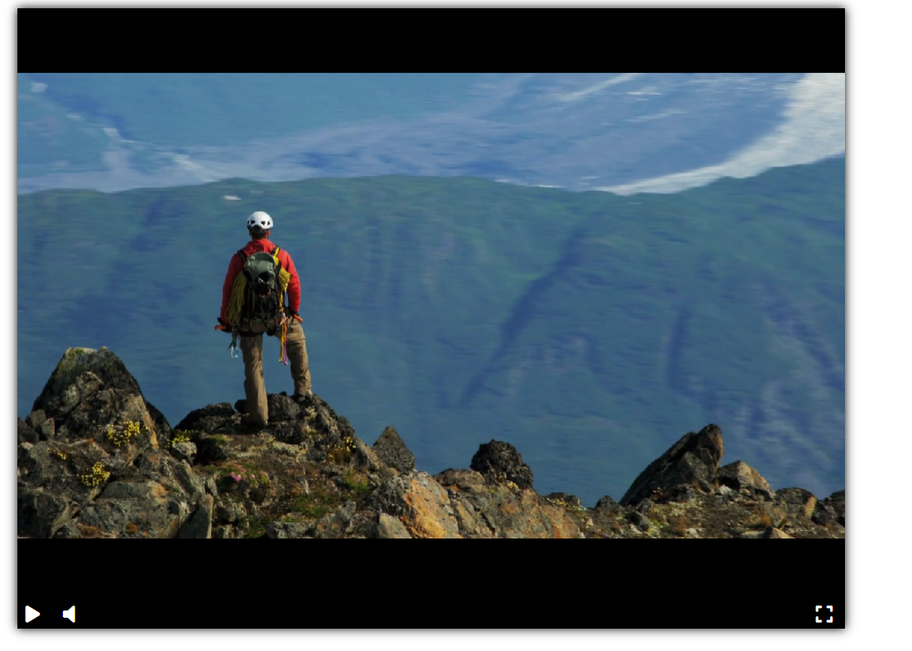

# Video Player.
Проект по верстке видеоплеера. Проект построен на js-библиотеке [video-player-jslib](https://github.com/devmanorg/video-player-jslib).

## Video player example.
Пример работы плеера можно посмотреть [тут](https://triple-s-rank.github.io/video_player/)
## Running player locally.

 - Копировать репозиторий командой  

`git clone git@github.com:triple-s-rank/video_player.git`

 - В скопированной директории открыть файл `index.html`
